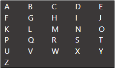

## Display the Shortest Path to Display a String on the Screen

Given a screen containing alphabets from A to Z,

Screen:

We can navigate from one character to another using a remote control. The remote control has Left, Right, Up, Down, and OK buttons. Find the shortest possible path to type all the characters of a given string using the remote control. The initial position is at the top left “on the A”, and we must start with vertical movements if they exist. All characters in the input string must be printed in order.

If a letter is lowercase, it must be changed to uppercase.

Write a method named `shortestPath`. This method takes a string as a parameter and returns an array of paths to follow with the remote control.

### Example Output:

**Input:** "COZY"

**Output:** {Right, Right, OK, Down, Down, Right, Right, OK, Down, Down, Down, Left, Left, Left, Left, OK, Up, Right, Right, Right, Right, OK}
