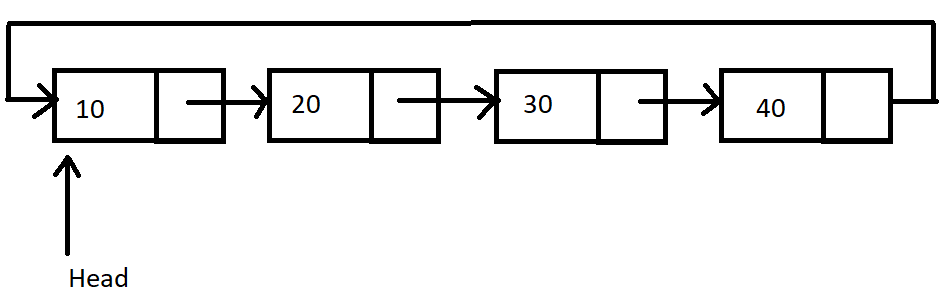

# Challenge 42: Check if a Linked List is Circular

We started by defining a class for the nodes of the list.
```java
public class Node {
    int data;
    Node next;

    public Node(int data) {
        this.data = data;
        this.next = null;
    }
}
```
Write a method named `isCircular` that takes a singly linked list of type `Node` as a parameter and returns `true` if it is circular, otherwise `false`.

A linked list is called circular if all the nodes are connected in the form of a cycle.

Here is an example of a circular linked list:



