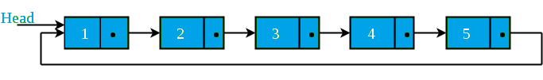
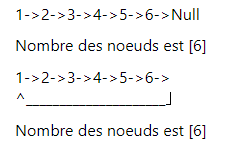

# Count Nodes in a Linked List

We started by defining a class for the nodes of the list.

```java
public class Node {
    int data;
    Node next;

    public Node(int data) {
        this.data = data;
        this.next = null;
    }
}
```
Write a method named `countNodes` that takes a linked list (circular or not) of type `Node` as a parameter and returns the number of nodes.

For example, the output is 5 for the list below:



**Exemple de sortie :**

