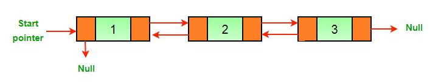
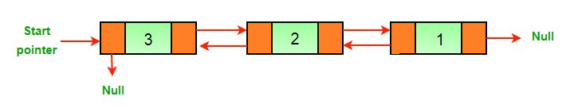

# Reverse a Doubly Linked List

We started by defining a class for the nodes of the list.

```java
public class Node {
    int data;
    Node next;
    Node prev;

    public Node(int data) {
        this.data = data;
        this.next = null;
        this.prev = null;
    }
}
```
Write a method named `reverse` that takes a doubly linked list of type `Node` as a parameter and reverses it.

Example Output:

**Input:**



**Output:**



