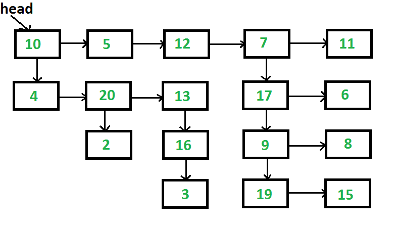

### Flatten a Linked List

We started by defining a class for the nodes of the list.
```java
class Node {
    int data;
    Node next;
    Node child;

    // Constructor to initialize the node with data
    Node(int d) {
        data = d;
        next = child = null;
    }
}
```
Given a linked list where, in addition to the next pointer, each node has a child pointer, which may or may not point to a separate list. These child lists can have one or more children of their own, and so on, producing a multi-level data structure, as illustrated in the figure below. Write a method `flattenList` that takes a list of type `Node` as a parameter and flattens the list so that all nodes appear in a single-level linked list. You should flatten the list such that all nodes at the first level come first, followed by nodes at the second level, and so on.

#### Example Output:

**Input:**  


**Output:**  
`10->5->12->7->11->4->20->13->17->6->2->16->9->8->3->19->15`
