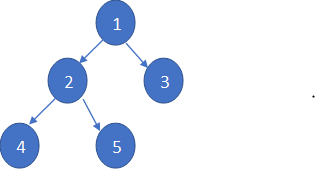

# Maximum Depth or Height of a Binary Tree

We start by defining a class for the nodes of the binary tree.

```java
class Noeud {
    int donnee;
    Noeud gauche;
    Noeud droite;

    // Constructeur pour initialiser un nœud avec une valeur donnée
    Noeud(int item) {
        donnee = item;
        gauche = droite = null;
    }
}
```
Given a binary tree, the task is to find the height of the tree. The height of the tree is the number of vertices in the tree from the root node to the deepest node.

**Note:** The height of an empty tree is 0, and the height of a tree with only one node is 1.

Write a recursive method `maximumDepth` that takes a tree of type `Node` as a parameter and returns the depth (as an integer).

### Example Output:

**Input:**



**Output:** 3
