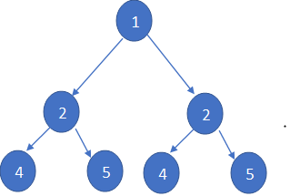

### Symmetric Tree

We started by defining a class for the nodes of the binary tree.
```java
class Node {
    int data;
    Node left;
    Node right;

    // Constructor to initialize a node with a given value
    Node(int item) {
        data = item;
        left = right = null;
    }
}
```
Write a method named `isSymmetric` that takes a tree of type `Node` as a parameter and returns `true` if it is symmetric, otherwise `false`.

#### Example Output:

- **Input:**  

- **Output:** `false`

- **Input:**  

- **Output:** `true`
