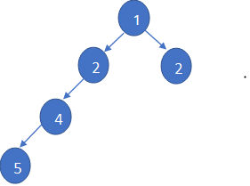
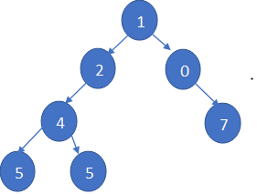

# Height-Balanced Binary Tree

We started by defining a class for the nodes of the binary tree.
```java
class Node {
    int data;
    Node left;
    Node right;

    // Constructor to initialize a node with a given value
    Node(int item) {
        data = item;
        left = right = null;
    }
}
```
Write a method named `isBalanced` that takes a binary tree of type `Node` as a parameter and returns `true` if the tree is balanced, otherwise returns `false`.

A height-balanced binary tree is a binary tree in which the height of the left and right subtrees of any node differs by no more than 1, and both the left and right subtrees are also height-balanced.

#### Example Output:

- **Input:**

 

- **Output:** `false`

- **Input:**

 
 
- **Output:** `true`
