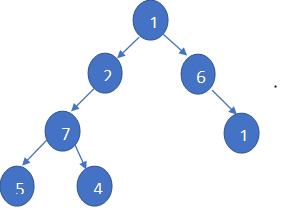
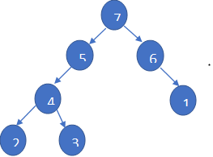

# Max Heap

We start by defining a class for the binary tree nodes:

```java
class Node {
    int data;
    Node left;
    Node right;

    // Constructor to initialize a node with a given value
    Node(int item) {
        data = item;
        left = right = null;
    }
}
```
A heap is a specialized tree-based data structure that satisfies the heap property. In a Max Heap, for every node `i` other than the root, the value of `i` is less than or equal to the value of its parent. In a Min Heap, for every node `i` other than the root, the value of `i` is greater than or equal to the value of its parent.

- **Max Heap**: In a Max Heap, the value of the parent node is always greater than or equal to the values of its children.

- **Min Heap**: In a Min Heap, the value of the parent node is always less than or equal to the values of its children.

Write a method named `isMaxHeap` that takes a binary tree of type `Node` as a parameter and returns `true` if it is a Max Heap; otherwise, it returns `false`.

### Example Output:

**Input:**


**Output:** false

**Input:**


**Output:** true