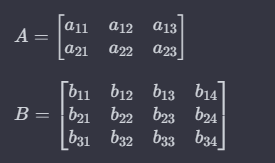
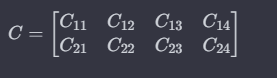

# Matrix Multiplication

Given two matrices, the task is to multiply them. The matrices can be either square or rectangular.

Let A be a matrix of dimensions m x n (m rows and n columns), and B be a matrix of dimensions n x p (n rows and p columns). The matrix product of A and B, denoted as AB, results in a matrix C of dimensions m x p. Each element of the resulting matrix C is obtained by multiplying the corresponding elements from the rows of A with the columns of B and summing these products.




## Element Calculation

The elements of C are calculated as follows:

- C11 = (a11 *b11) +(a12 *b21) +(a13 *b31) 
- C12 = (a11 *b12) +(a12 *b22) +(a13 *b32) 
- C13 = (a11 *b13) +(a12 *b23) +(a13 *b33) 
- C14 = (a11 *b14) +(a12 *b24) +(a13 *b34)
- C21 = (a21 *b11) +(a22 *b21) +(a23 *b31)
- C22 = (a21 *b12) +(a22 *b22) +(a23 *b32) 
- C23 = (a21 *b13) +(a22 *b23) +(a23 *b33) 
- C24 = (a21 *b14) +(a22 *b24) +(a23 *b34) 

## Method

Create a method `multiplyMatrix` that takes matrices A and B as parameters and returns the resulting matrix C = A * B.

### Example Output:

**Input:**

```java
mat1[3][2] = {
    {1, 1},
    {2, 2},
    {3, 3}
};

mat2[2][3] = {
    {1, 1, 1},
    {2, 2, 2}
};
```
**Output:**

Resulting Matrix:

3 3 3 

6 6 6 

9 9 9 
